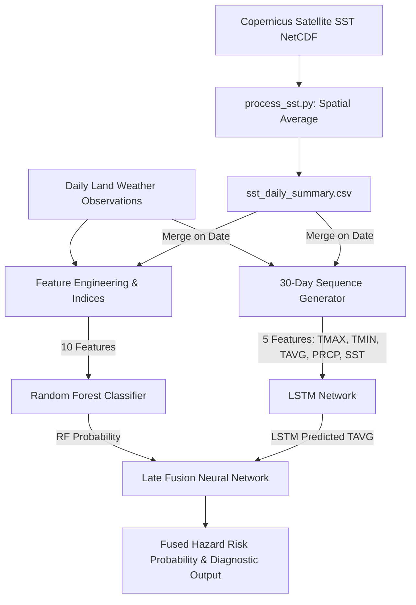

# Multimodal Climate Change Impact Model — U.S. Environment

This repository implements a **Multimodal Climate Hazard & Flood Predictor** that fuses land-based meteorological observations with satellite-derived ocean temperatures to predict localized climate hazard risks.

## 🌟 Features
- **Multimodal Fusion Architecture**: Integrates daily weather observations (air temperatures, precipitation) with Copernicus daily Satellite Sea Surface Temperature (SST).
- **Hybrid Machine Learning & Deep Learning**:
  - **LSTM (Deep Learning)**: Predicts average daily temperature trends based on 30-day temporal sequences.
  - **Random Forest (Tabular Machine Learning)**: Classifies daily hazard risks using calculated meteorological indices (Heat Index, Wind Chill, Wet Bulb temperature, precipitation and temperature anomalies).
  - **Late Fusion Meta-Learner**: Combines predictions from both models through a dense neural network to output the final Hazard Risk Probability.
- **Dynamic Bounding-Box Downloader**: Fetches gridded NetCDF sea surface temperature data efficiently using Copernicus CDS API spatial subsetting.
- **Interactive Dashboard**: Streamlit interface to visualize trends, load historical stations, and adjust slider parameters to compute hazard profiles in real-time.

---

## 📐 Model Architecture



---

## 🛠️ Installation & Setup

### 1. Install Dependencies
Ensure you have Python 3.10+ installed. Install the package dependencies:
```bash
pip install -r requirements.txt
```

### 2. Configure Copernicus Climate Data Store (CDS) API
To retrieve the Satellite Sea Surface Temperature dataset:
1. Register/Log in to the [Copernicus Climate Data Store](https://cds.climate.copernicus.eu/).
2. Retrieve your personal access token (key) from your CDS profile.
3. Create a local configuration file named `.cdsapirc` in the project root directory:
   ```text
   url: https://cds.climate.copernicus.eu/api
   key: YOUR_PERSONAL_ACCESS_TOKEN
   ```

---

## 🚀 Running the Project

### 1. Download Sea Surface Temperature Data
Start the chunked background downloader to retrieve the SST NetCDF data (1980–2025):
```bash
python fetch_ecmwf.py
```
This saves data chunks sequentially in `sst_chunks/`.

### 2. Extract & Compile NetCDF Files
Run the pre-processing compiler to extract the NetCDF data, convert temperature values to Celsius, and generate the time-series summary `sst_daily_summary.csv`:
```bash
python process_sst.py
```

### 3. Train the Models
Train the LSTM, Random Forest, and Late Fusion layers on the weather station simulator and SST data:
```bash
python train_now.py
```
This saves the serialized models and scalers into `saved_models/`.

### 4. Run the Streamlit Dashboard
Launch the interactive prediction and analytical dashboard locally:
```bash
streamlit run app.py
```
Navigate to the local URL (usually **http://localhost:8501**) in your web browser.

---

## 📁 Repository Structure
- `app.py`: Streamlit main dashboard and frontend interface.
- `ml_model.py`: Core `HazardPredictor` pipeline containing feature engineering, LSTM, Random Forest, and Late Fusion implementation.
- `noaa_client.py`: NOAA data client with a daily simulated weather generator fallback.
- `fetch_ecmwf.py`: Script to download chunked satellite sea surface temperature data.
- `process_sst.py`: NetCDF parser to extract and compile daily average SSTs.
- `train_now.py`: Utility to train model weights from the CLI.
- `requirements.txt`: Python package dependencies.
- `.gitignore`: Files excluded from Git version control.
